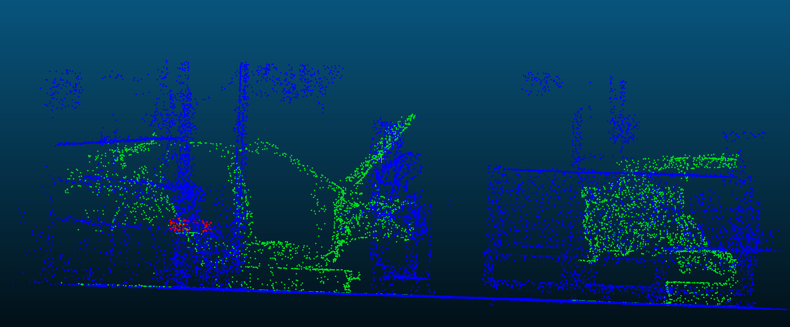
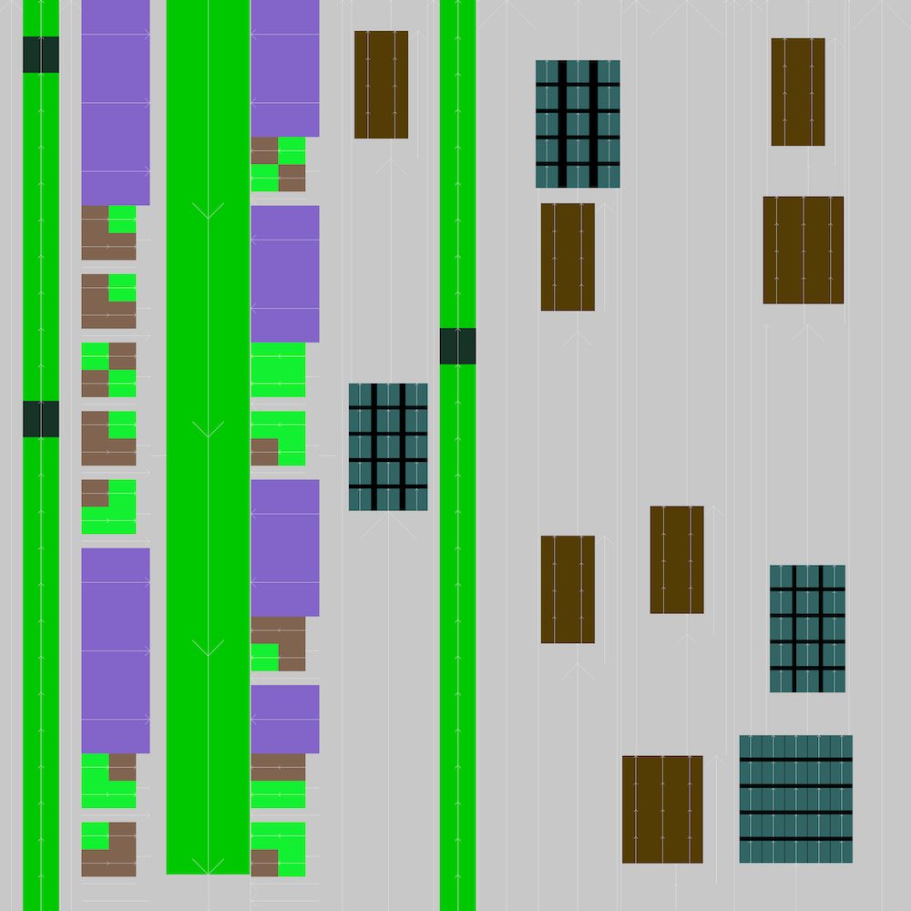

# 3DGene

## Datasets
*datasets:* contains the datasets used during the experiments, so it is possible to replicate our results. The point clouds are stored in PLY format where each point has the following features: x, y, z, red, green, blue, label. The label attribute is an integer specifying the point's class.

## Layout Generation
*src:* contains the source code for layout generation (first step of 3DGene). The code is written in python, we provide a few example *'region generators'* under 'layoutgeneration/strat'.

*example:*Contains and example on how to use the layout generation package, in addition to a sample input (json files).

